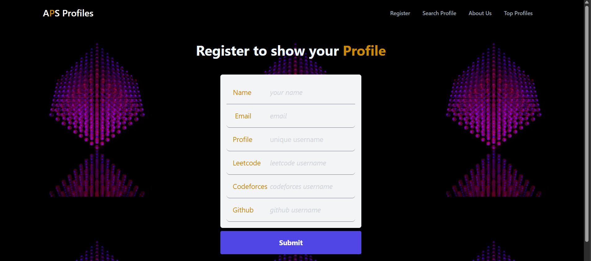

# Coders Profiles

Coders Profiles is a React-based web application that allows users to register and view coding profiles from platforms like LeetCode, Codeforces, and GitHub. The application fetches and displays relevant user data, offering a streamlined interface for coders to showcase their achievements.

## Features
- User Registration: Secure registration system to access the platform.
- Profile Data Fetching: Retrieves coding data from LeetCode, Codeforces, and GitHub.
- Modern UI: Built with React for a responsive and dynamic user experience.
- Easy Navigation: Intuitive interface to browse coding profiles.

## DEMO


## Technologies Used
- **Frontend:** React, Tailwind CSS
- **APIs:** LeetCode, Codeforces, GitHub
- **State Management:** React Hooks

## Getting Started
### Prerequisites
- Node.js and npm installed

### Installation
```bash
git clone https://github.com/ankesh15/coders-profiles.git
cd coders-profiles
npm install
npm start
```

### Running the Application
```bash
npm start
```
The app will run on `http://localhost:3000`.

## Usage
1. Register an account.
2. Connect coding profiles (LeetCode, Codeforces, GitHub).
3. View your profile data and share it with others.

## Contributing
Feel free to open issues or submit pull requests for improvements and features.

## License
This project is licensed under the MIT License.

## Acknowledgements
- LeetCode, Codeforces, GitHub for their APIs
- React and Tailwind CSS communities

